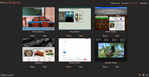

# Portfolio

Developers portfolio site to showcase projects using React.js and hosted on Github pages.

## Navigation

Site is layed out in four sections each with thier correspoding titles.

- About me
  - Holds an image with a brief description introducing myself
- Contact
  - Has a contact form that isn't fully functional (no backend)
- Portfolio
  - Catalog of 6 projects all hosted on a live site with a link to corresponding Github Repo
- Resume
  - Contains a list of proficiencies and a link that automatically downloads my resume

### [Live Site](https://niles87.github.io/psychic-octo-port)
